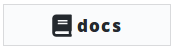
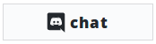
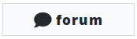
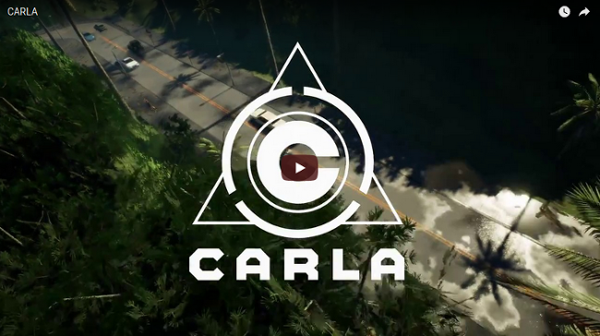

CARLA Simulator - Introducción
===============

<!--  -->

*CARLA is an open-source simulator for autonomous driving research. CARLA has
been developed from the ground up to support development, training, and
validation of autonomous driving systems. In addition to open-source code
and protocols, CARLA provides open digital assets (urban layouts, buildings,
vehicles) that were created for this purpose and can be used freely. The
simulation platform supports flexible specification of sensor suites and
environmental conditions.*

-------
## Sistemas Inteligentes y Avanzados

Para este trabajo, aprovechando el entorno que ofrece CARLA, hemos decidido usar y generar un modelo inteligente que aprenda por sí mismo a moverse y desenvolverse por un mapa urbano, en particular, *Town02*, intentando respetar tanto los límites de velocidad así como semáforos y demás obstáculos que se puedan ir encontrando a lo largo del recorrido.

Para ello, se han usado los modelos de "aprendizaje por refuerzo" y "aprendizaje por imitación". En el primero de ellos, el vehículo se entrena "solo" según determinadas condiciones, obteniendo una recompensa o un castigo dependiendo de cómo se desenvuelva.
Durante esta primera fase, se dedicó mucho tiempo para generar un modelo que ya fuera capaz de al menos poder recorrer 100 metros por sí mismo.
Después, el modelo se preparó para recibir un "aprendizaje por imitación", en el cual nosotros llevábamos el coche respetando las normas de circulación y el modelo ya preparado se adaptaba a nuestras decisiones e iba cumplimentando su aprendizaje.

Tras todo este trabajo, el resultado y la evolución puede verse en el siguiente vídeo:

**NOTA:** los resultados obtenidos no se adjuntan debido a su gran tamaño (~30 GB).

-------

License
-------

CARLA specific code is distributed under MIT License.

CARLA specific assets are distributed under CC-BY License.

Note that UE4 itself follows its own license terms.
